name: inverse
layout: true
class: center, middle, inverse
---
## Diagrammatic Coupled Cluster Monte Carlo

.author[Roberto Di Remigio]

.institution[UiT - The Arctic University of Norway]

.institution[Department of Chemistry - Virginia Tech]

.date[13 June 2019, Telluride]

.footnote[[CC BY 4.0](https://creativecommons.org/licenses/by/4.0/) licensed.
Browse slides at [http://tinyurl.com/talk-telluride](http://tinyurl.com/talk-telluride)]

???

---
layout: false

.left-column[
## Outline
]
.right-column[
#### Coupled cluster theory
#### The diagrammatic approach
#### Stochastic coupled cluster
#### Bringing it all together
]

???

---

## Coupled cluster theory

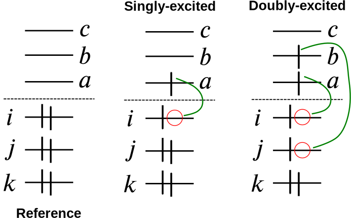

`
$$
|\mathrm{CC}\rangle = \mathrm{e}^T |D_{\mathbf{0}}\rangle,
\quad
T = \sum_{u=1} T_u
$$
`

`
$$
T_u =
  \sum_{\substack{a_1\\ i_1}} t^{a_1}_{i_1}\tau_{i_1}^{a_1} +
  \frac{1}{4} \sum_{\substack{a_1, a_2 \\ i_1, i_2}} t^{a_1a_2}_{i_1i_2}\tau_{i_1i_2}^{a_1a_2} +
  \ldots +
  \frac{1}{(u!)^2} \sum_{\substack{a_1, a_2, \ldots, a_u \\ i_1, i_2, \ldots, i_u}}
t^{a_1a_2\ldots a_u}_{i_1i_2\ldots i_u}
\tau_{i_1i_2\ldots i_u}^{a_1a_2\ldots a_u},
$$
`

???

- Construct the many-electron wavefunction as a multideterminantal expansion.
- Generate excited determinants from a single reference determinant.
- Excitations
- Wave operator is **not** unitary: `$\mathrm{e}^{-T} \neq \mathrm{e}^{T^\dagger}$`

---

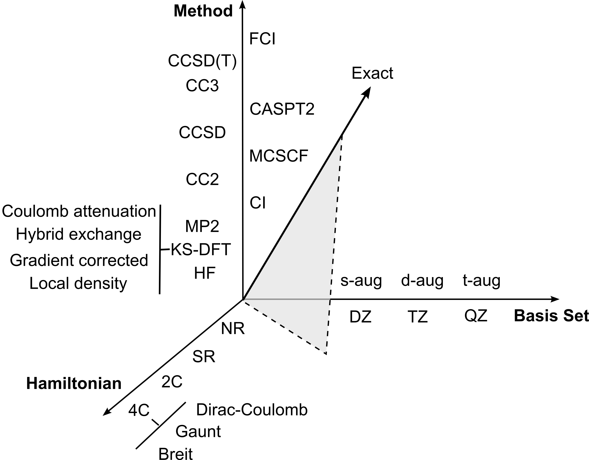

- Size-consistent and size-extensive
- Systematically improvable
- Polynomial scaling

???

---

## Coupled cluster equations: _unlinked_

`
$$
H_{\mathrm{N}}|\mathrm{CC} \rangle = \Delta E_{\mathrm{CC}}| \mathrm{CC} \rangle
$$
`

Assume _intermediate normalization_ `$ \langle D_{\mathbf{0}}| \mathrm{CC} \rangle = 1$`:

- Energy equation:

`
$$
\langle D_{\mathbf{0}} | H_{\mathrm{N}} |\mathrm{CC} \rangle =
\langle D_{\mathbf{0}} | H_{\mathrm{N}} (T_2 + T_1 + \frac{1}{2}T_1^{2})|D_\mathbf{0} \rangle =
\Delta E_{\mathrm{CC}}
$$
`

- Amplitude equations

`
$$
\langle D_{\mathbf{n}} | H_{\mathrm{N}} - \Delta E_{\mathrm{CC}} |\mathrm{CC} \rangle = 0
$$
`

- Size-extensive order-by-order, _not_ term-by-term

--
  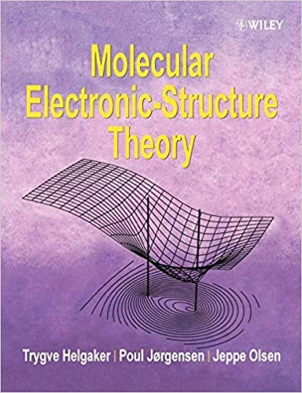

???

- Start from the normal-ordered Hamiltonian
- Project on reference determinant -> Get the energy (only singles and doubles needed)
- Project on excitation manifold -> Get amplitudes

---

## Coupled cluster equations: _linked_

`
$$
H_{\mathrm{N}}|\mathrm{CC} \rangle = \Delta E_{\mathrm{CC}}| \mathrm{CC} \rangle
$$
`

Assume _intermediate normalization_ `$ \langle D_{\mathbf{0}}| \mathrm{CC} \rangle = 1$`:

- Multiply by `$\mathrm{e}^{-T}$`:

`
$$
 \bar{H}_{\mathrm{N}} |D_\mathbf{0} \rangle =
\mathrm{e}^{-T} H_{\mathrm{N}} \mathrm{e}^{T} |D_\mathbf{0} \rangle = \Delta E_{\mathrm{CC}}| D_{\mathbf{0}} \rangle
$$
`

- Energy equation:

`
$$
\langle D_{\mathbf{0}} | \bar{H}_{\mathrm{N}} |\mathrm{CC} \rangle = \Delta E_{\mathrm{CC}}
$$
`

- Amplitude equations

`
$$
\langle D_{\mathbf{n}} | \bar{H}_{\mathrm{N}} | D_\mathbf{0} \rangle = 0
$$
`

- Size-extensive order-by-order _and_ term-by-term

???

- Start from the normal-ordered Hamiltonian
- Project on reference determinant -> Get the energy (only singles and doubles needed)
- Project on excitation manifold -> Get amplitudes

---

## From `$\bar{H}_\mathrm{N}$` to diagrams

- Baker-Campbell-Hausdorff expansion truncates

`
$$
\begin{aligned}
 \bar{H}_{\mathrm{N}} &=
       H_{\mathrm{N}} +
       [H_{\mathrm{N}}, T] +
       \frac{1}{2!}[[H_{\mathrm{N}}, T], T] \\ &+
       \frac{1}{3!}[[[H_{\mathrm{N}}, T], T], T] +
       \frac{1}{4!}[[[[H_{\mathrm{N}}, T], T], T], T]
\end{aligned}
$$
`

- Only connected terms contribute

???

- BCH truncates because the Hamiltonian is a two-body operator
- normal ordering, generalised Wick's theorem

---
count: false

## From `$\bar{H}_\mathrm{N}$` to diagrams

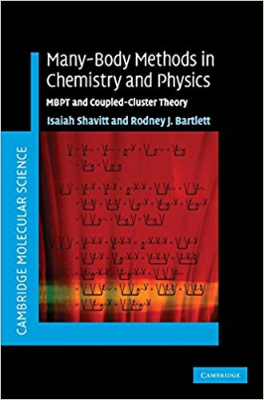

---
class: split-50-50

## Diagrammatic representation

  

  

.column[
### Excitors

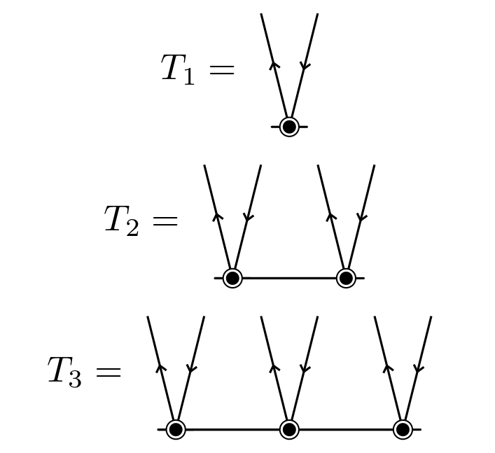

]

.column[
### Hamiltonian

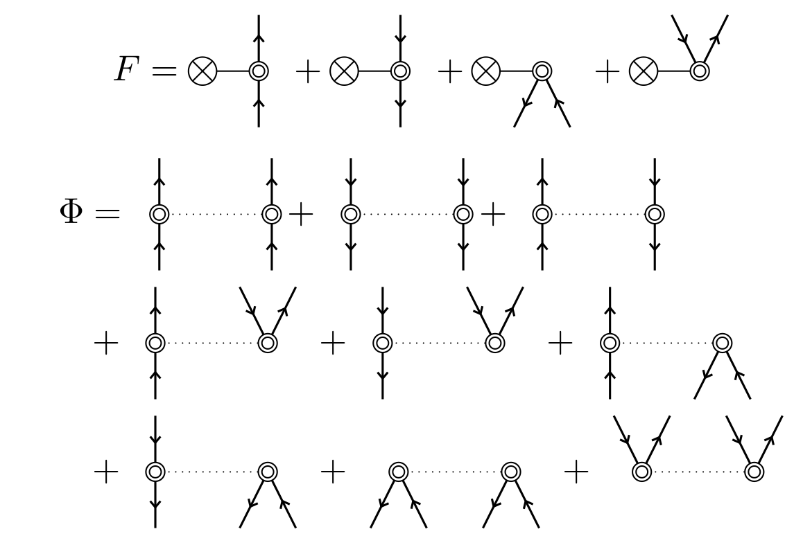

]

???

- Hole and particle lines
- Hamiltonian pieces

---
class: split-50-50

## Diagrammatic representation, contd.

  

  

.column[
### Excitors

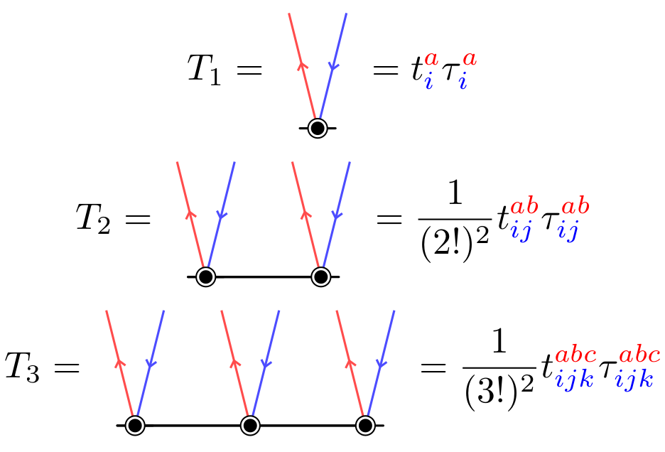

]

.column[
### Hamiltonian

]

---

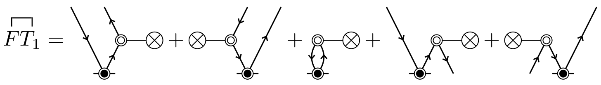

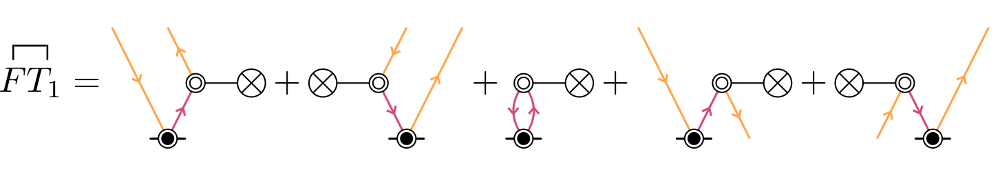

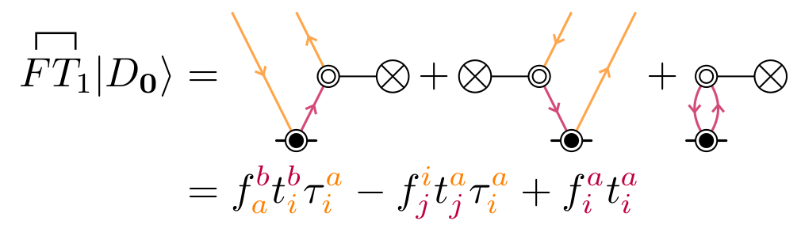

???

- We represent contractions with connecting lines
- Internal _vs_ external lines. The former are summed over.
- Loops, equivalent lines, signs, permutations

---

## Solving the coupled cluster equations

- Derive equations from diagrams
- Factorise nonlinear terms

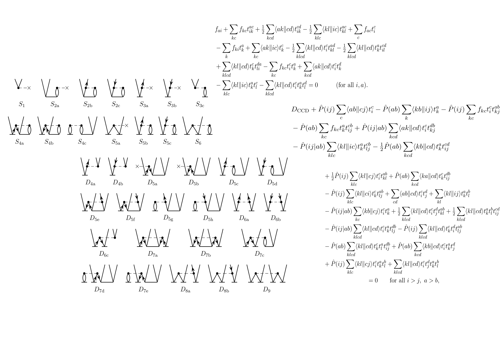

???

- An explosion of terms, can be automated, but factorisation is nontrivial
- Dense algebra, nontrivial to parallelise

---
layout: false

## From deterministic to stochastic.red[1]

- Finite-different imaginary-time propagation

`
$$
| \Psi(\tau+\delta\tau) \rangle = [1 - \delta\tau(H - S)] | \Psi(\tau) \rangle
$$
`

- Modified CC Ansatz

`
$$
| \mathrm{CCMC} \rangle = N_{0}\mathrm{e}^{\frac{T^\prime}{N_0}} |D_{\mathbf{0}}\rangle
$$
`

where `$ \langle D_{\mathbf{0}}| \mathrm{CCMC}(\tau) \rangle = N_0(\tau)$`

- _Unlinked_ dynamic equation

`
$$
t_{\mathbf{n}}(\tau+\delta\tau) = t_{\mathbf{n}}(\tau) - \delta\tau
  \langle D_{\mathbf{n}} | H - S | \mathrm{CCMC}(\tau) \rangle
$$
`

.footnote-cite[.red[1] Thom, A. J. W. _Phys. Rev. Lett._ (2010), **105**, 263004]

???

- Sample the wavefunction
- Sample action of Hamiltonian
- Whereas results will be size-extensive and consistent, terms to sample may
not scale linearly with system size, even for perfectly noninteracting systems.

---
## Size extensivity and memory cost

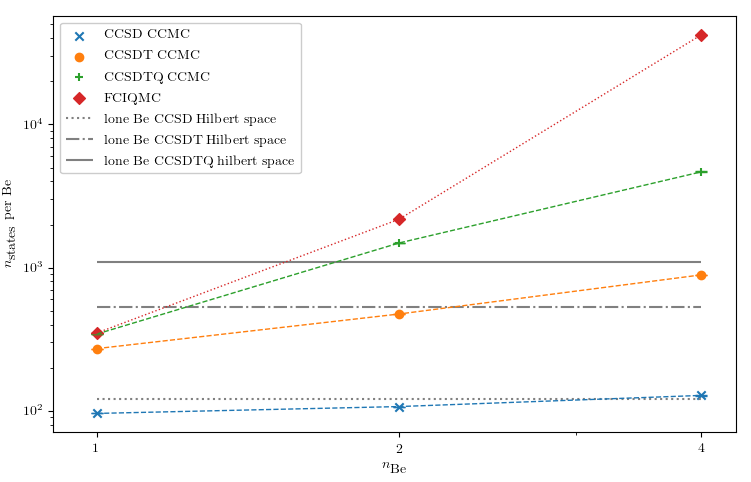

???

- These are noninteracting replicas of Be atoms. Easy system.
- Cost is emphatically growing faster than linear.
- Why so? We are sampling terms that cancel out exactly in the end, but we're
still doing that part of the work and using memory for it.

---
## Learning new tricks from an old dog

- Imaginary-time Schrödinger equation.red[2]
`
$$
\frac{\mathrm{d}}{\mathrm{d}\tau} | \mathrm{CC} \rangle = -H | \mathrm{CC} \rangle
$$
`

- _Constant_ intermediate normalization
`
$$
\frac{\mathrm{d}t_{\mathbf{n}}}{\mathrm{d}\tau} = - \langle D_{\mathbf{n}} | \bar{H}_{\mathrm{N}}(\tau) | D_\mathbf{0} \rangle
$$
`

- Finite difference
`
$$
t_{\mathbf{n}}(\tau+\delta\tau) = t_{\mathbf{n}}(\tau) - \delta\tau\langle D_{\mathbf{n}} | \bar{H}_{\mathrm{N}}(\tau) | D_\mathbf{0} \rangle
$$
`

.footnote-cite[.red[2] Pigg, D. A.; Hagen, G.; Nam, H.; Papenbrock, T. _Phys. Rev. C Nucl. Phys._ (2012), **86**, 014308]

???

- Use the linked formulation, because terms are size-extensive by construction
- Rather than sample the commutator expansion, as done by Franklin _et al._,
enforce connectedness by using diagrammatic techniques.

---
## Diagrammatic Coupled Cluster Monte Carlo.red[3]

`
$$
t_{\mathbf{n}}(\tau+\delta\tau) = t_{\mathbf{n}}(\tau) - \delta\tau\textcolor{red}{\langle D_{\mathbf{n}} | \bar{H}_{\mathrm{N}}(\tau) | D_\mathbf{0} \rangle}
$$
`

### Idea and Plan

- The _residual_ integral `$\textcolor{red}{\langle D_{\mathbf{n}} | \bar{H}_{\mathrm{N}}(\tau) | D_\mathbf{0} \rangle} = \sum \mathrm{diagrams}$`
- Build diagrams on the fly, _stochastically_
- _Stochastic_ rounding of amplitudes.

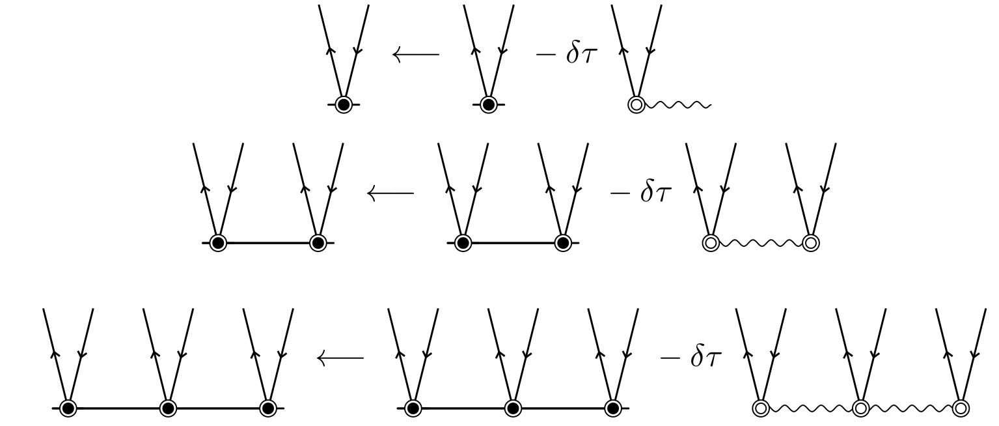

???

- The red terms is a sum of diagrams. We can devise an algorithm to sample this
integral by building diagrams on the fly
- Stochastic rounding ensures sparse representation.
- Additionally this can be interpreted on par with deterministic approaches!

.footnote-cite[.red[3] Scott, C. J. C.; Di Remigio, R.; Crawford, T. D.; Thom, A. J. W. _J. Phys. Chem. Lett._ (2019), **10**, 925]

---

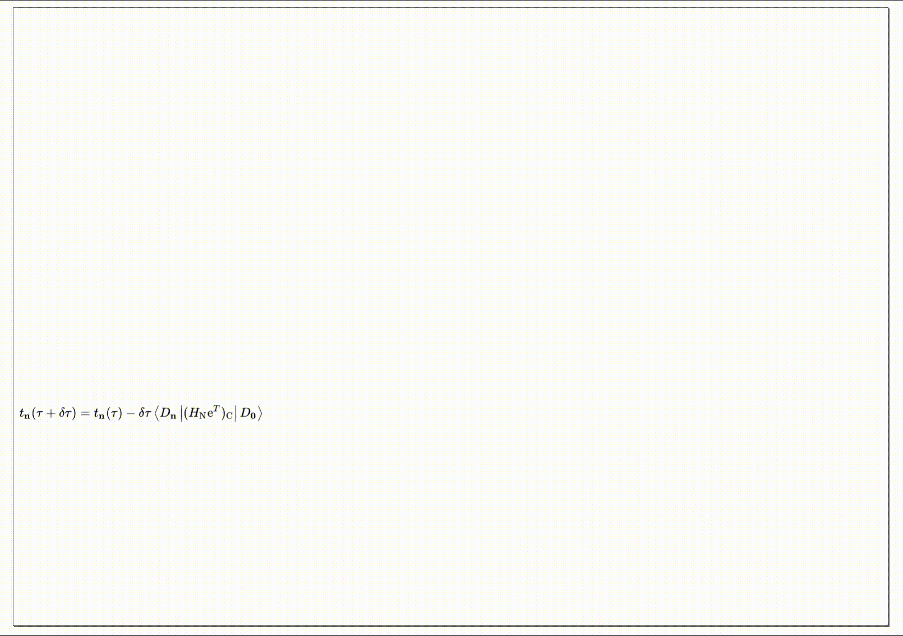

.footnote-cite[Animation courtesy Katia Di Antonio]

---
## Size extensivity and memory cost, contd.

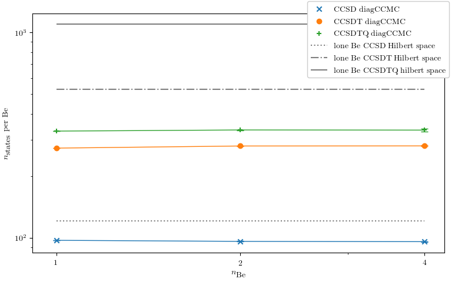

---
## CPU cost

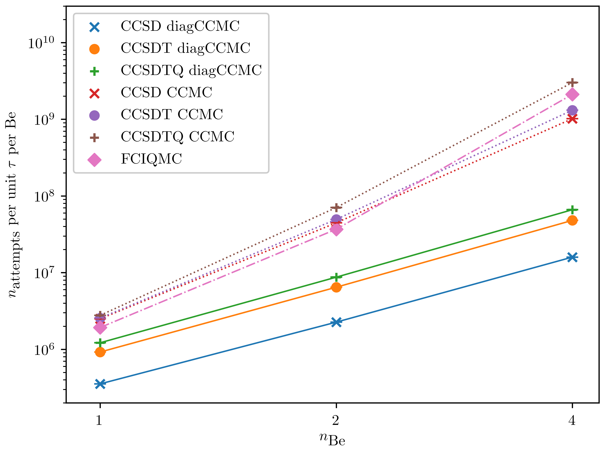

---
## Locality

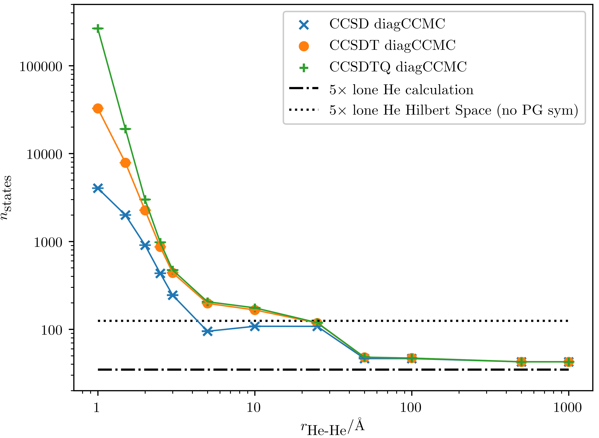

---
## Acknowledgements

---
name: last-page
template: inverse

# Thanks for your attention!

Slideshow created using [remark] and served using [cicero]

Slides available on [GitHub](https://github.com/robertodr/talk-telluride)

Browse slides at [http://tinyurl.com/talk-telluride](http://tinyurl.com/talk-telluride)

[remark]: https://github.com/gnab/remark
[cicero]: https://github.com/bast/cicero
